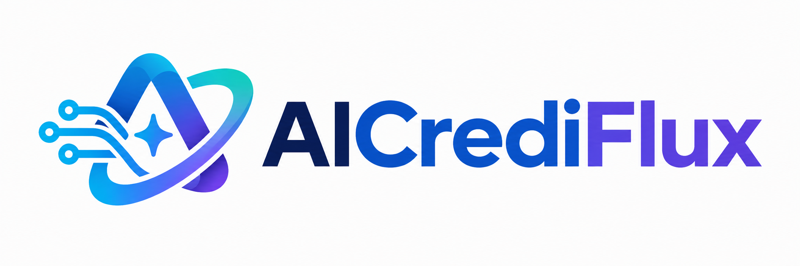
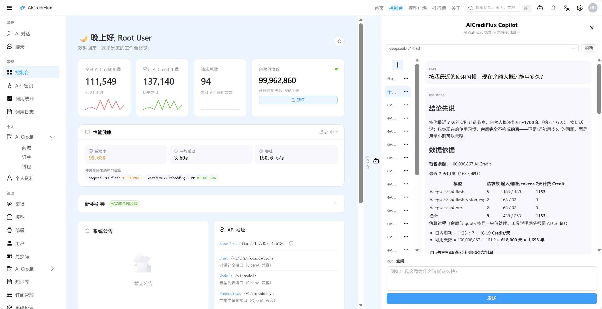
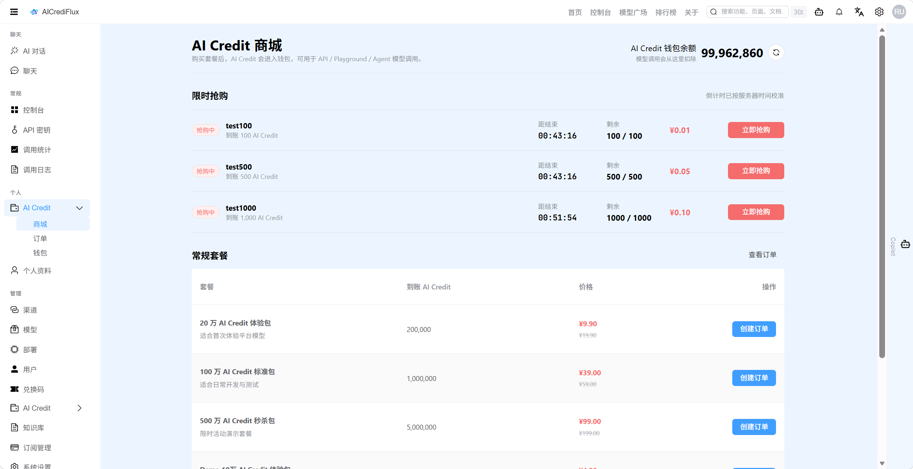
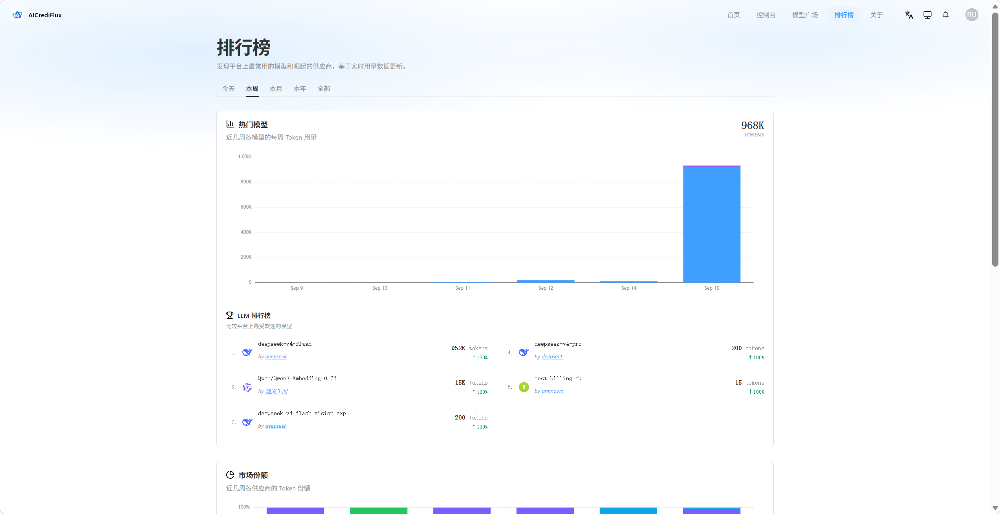
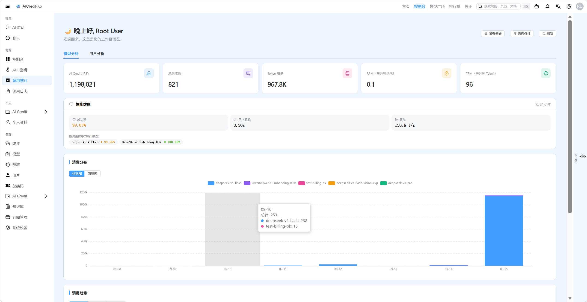

<div align="center">



### AI 网关 · AI Credit 计费 · Spring AI Copilot · RAG 知识库

<p>
  
  
  
  
  
  
</p>

一个集 **模型网关、AI Credit 计费、高并发套餐交易、Spring AI Copilot、Tool Calling、RAG 知识库与可复跑评测体系** 于一体的全栈 AI Gateway 项目。

</div>

---

## 🌟 项目简介

AICrediFlux 是一个面向 AI Gateway 场景的全栈工程实践项目，核心目标是把“大模型统一接入”扩展成一个更完整的平台：既能接入和路由多模型渠道，也能围绕 AI Credit 做计费、钱包、套餐交易、调用日志、智能诊断和指标化验收。

项目重点不只是“能调用模型”，而是打通从 **用户购买额度 → 模型调用分发 → AI Credit 扣费 → 日志追踪 → Copilot 诊断 → RAG 知识问答 → 自动化评测报告** 的完整闭环。

> ⚠️ 本项目仅用于合法授权的模型服务接入、组织内部管理、成本核算、私有化部署和工程学习。使用者需要自行确保上游模型、API Key、支付、日志留存和生成式 AI 服务合规。

---

## 🚀 核心亮点

### 💳 统一模型网关与 AI Credit 计费

- 支持 OpenAI Chat Completions、Embeddings 等兼容接口。
- 统一收敛 API、Playground、Copilot、RAG Index、RAG Query 的模型调用入口。
- 通过模型、渠道、分组、倍率和用户钱包完成 AI Credit 预扣、结算、失败退款和调用日志记录。
- 使用 `requestId`、`sessionNo`、`runNo` 串联模型分发、Agent Run、usage、钱包流水和调用日志。
- 用户侧统一展示 AI Credit；Token 仅保留为输入输出明细和成本核算依据。

### ⚡ Token 套餐与秒杀交易链路

- 实现 AI Credit 套餐购买、模拟支付、钱包到账和订单状态机。
- 秒杀链路覆盖 Redis 库存预占、用户去重、异步建单、RocketMQ、Outbox 重试、超时关单和库存回补。
- 通过业务幂等和补偿任务处理重复消费、支付/关单竞争、重复到账和库存一致性问题。
- 提供 JMeter 压测脚本，可解析 100 / 500 / 1000 并发下的 QPS、P95、P99 和错误率。

### 🤖 Spring AI Copilot

- Copilot 后端严格基于 **Spring AI**，与 **Spring Boot** 良好集成。
- 通过自定义 `ChatModel` 适配现有模型分发和 AI Credit Billing，保留平台自己的渠道选择、模型映射和计费能力。
- 右侧 Copilot Dock 支持模型选择、会话重命名、删除、拖拽排序、Markdown 渲染、停止生成、运行状态展示和引用来源展示。
- SSE 事件覆盖 `status`、`text_delta`、`tool_start`、`tool_result`、`rag_refs`、`usage`、`done`、`error`、`cancelled`。

### 🛠️ Tool Calling 诊断能力

Copilot 当前开放四个只读业务工具：

| 工具 | 能力 |
| --- | --- |
| `walletBalance` | 查询当前用户 AI Credit 余额 |
| `modelPrice` | 查询模型价格、倍率和预估消耗 |
| `usageSummary` | 查询当前用户近期用量统计 |
| `channelStatus` | root/admin 查询渠道状态、延迟、错误和可用性 |

工具调用会写入 `mr_agent_tool_log`，前端展示工具轨迹。普通用户不能查询他人数据，也不能查看渠道密钥、API Token、Provider Key 等敏感信息。

### 📚 RAG 平台知识库

- 管理员可以维护平台公共 Markdown/Text 知识库。
- 文档上传后完成分块、Embedding、Milvus 写入和版本记录。
- Copilot 对平台说明、模型接入、计费规则、错误排查类问题优先检索知识库。
- 回答通过 SSE 返回 `rag_refs`，前端展示引用标题、空间、定位和片段。
- Embedding 调用和最终回答调用都进入统一 AI Credit 计费链路。

### 📊 可复跑评测体系

项目内置 Agent/RAG Golden Set、RAG 语料和 JMeter 压测脚本，用于反复评估项目改进效果。

```text
data/eval/                  Agent/RAG 评测数据集
scripts/agent-eval.ps1      Agent + RAG 评测
scripts/jmeter-eval.ps1     秒杀 JMeter 压测
scripts/eval.ps1            汇总 Agent/JMeter 结果并生成报告
```

评测指标覆盖：

- Agent：工具选择正确率、工具执行成功率、权限拦截率、终态唯一率、敏感信息清洁率。
- RAG：Recall@5、Recall@8、MRR@8、引用有效率、可检索率。
- JMeter：QPS、P95、P99、错误率、样本数。

---

---

## 🖥️ 界面效果

### 🎛️ 控制台与 Copilot

控制台集中展示 AI Credit、请求量、余额健康度和性能概览，右侧 Copilot Dock 提供余额分析、用量诊断、工具调用和 RAG 引用。

<p align="center">
  
</p>

### 💰 AI Credit 商城

支持限时抢购、常规套餐、订单创建和 AI Credit 钱包到账，适合演示完整的额度交易链路。

<p align="center">
  
</p>

### 🏆 模型排行榜

按时间范围查看模型 Token 用量、热门模型和供应商使用情况，为模型运营和成本分析提供数据视图。

<p align="center">
  
</p>

### 📈 调用统计

通过 AI Credit 消耗、请求数、Token 用量、RPM、TPM、成功率和延迟等指标观察平台运行情况。

<p align="center">
  
</p>

---

## 🧱 技术栈

| 模块 | 技术 |
| --- | --- |
| 后端 | Java 17、Spring Boot 3、MyBatis-Plus、Sa-Token、Flyway |
| Agent / RAG | Spring AI、ChatClient、ChatModel、ToolCallback、EmbeddingModel |
| 数据与中间件 | MySQL、Redis、RocketMQ、Milvus、MinIO、etcd |
| 前端 | Vue 3、TypeScript、Vite、Element Plus |
| 测试与验收 | JUnit、Mockito、JMeter、Node.js Eval Scripts |
| 部署 | Docker、Docker Compose |

---

## 📁 项目结构

```text
aicrediflux-token-server/   后端服务
aicrediflux-token-web/      前端管理台
data/eval/                  Agent/RAG 评测数据集
scripts/                    评测脚本和辅助脚本
rocketmq/                   本地 RocketMQ 配置
```

`docs/` 主要用于本地学习文档、阶段记录和生成的评测报告，默认不提交到 Git。

---

## 🏁 本地启动

### 1. 启动基础依赖

```powershell
docker compose -f docker-compose.dev.yml up -d
```

RAG 需要额外启动 Milvus 相关服务：

```powershell
docker compose -f docker-compose.dev.yml --profile ai up -d
```

### 2. 启动后端

```powershell
cd aicrediflux-token-server
mvn spring-boot:run
```

### 3. 启动前端

```powershell
cd aicrediflux-token-web
pnpm install
pnpm dev
```

启动后进入管理端，先配置供应商、渠道、模型、模型定价和 abilities，再使用 API、Playground、Copilot 或 RAG。

---

## 🧪 评测流程

### 1. Agent / RAG 评测

```powershell
$env:AICREDIFLUX_EVAL_USER_TOKEN = '<普通用户 Web 登录 token>'
$env:AICREDIFLUX_EVAL_ADMIN_TOKEN = '<root/admin Web 登录 token>'
$env:AICREDIFLUX_EVAL_MODEL = 'deepseek-v4-flash'

powershell -ExecutionPolicy Bypass -File .\scripts\agent-eval.ps1 -SeedRag
```

输出：

```text
scripts/agent/results/agent-summary.json
```

### 2. JMeter 秒杀压测

建议每个并发档位使用独立秒杀活动：

```powershell
powershell -ExecutionPolicy Bypass -File .\scripts\jmeter-eval.ps1 `
  -CampaignIds 17 `
  -ThreadCounts 100 `
  -RampSeconds 2
```

输出：

```text
docs/eval/reports/jmeter-summary.json
```

### 3. 生成总报告

```powershell
powershell -ExecutionPolicy Bypass -File .\scripts\eval.ps1
```

输出：

```text
docs/eval/reports/eval-report-YYYYMMDD-HHmm.md
docs/eval/reports/eval-report-YYYYMMDD-HHmm.json
```

---

## 🔐 安全边界

- 当前 Tool Calling 只开放只读工具。
- 普通用户只能查询自己的钱包、价格和用量。
- 渠道诊断仅限 root/admin 用户。
- Provider Key、Channel Key、API Token、Authorization、password、secret 等敏感信息不会出现在工具结果、SSE 事件、assistant 文本或公开日志中。
- RAG 当前聚焦平台公共知识库；普通用户私有知识库、PDF/DOCX/XLSX 和联网搜索留作后续扩展。

---

## 🗺️ 后续计划

- 继续优化 Agent 和 RAG 检索能力。
- 持续优化秒杀链路的高并发能力、吞吐量和尾延迟表现。
- 为 Tool Calling 和 RAG 增加 feature flag、灰度发布和回滚策略。
- 扩展 RAG 文档类型和普通用户私有知识库。

---

## 📜 License

本项目基于 [Apache License 2.0](./LICENSE) 开源。

---

## 🙏 致谢

本项目参考了 [yaoshu-token](https://github.com/yaoshu-open/yaoshu-token) 的 AI Gateway 基础设计，并在此基础上进行了二次开发与功能扩展，重点补充了 AI Credit 计费闭环、高并发套餐交易、Spring AI Copilot、Tool Calling、RAG 知识库和评测体系。

感谢原项目及开源社区提供的工程参考。
